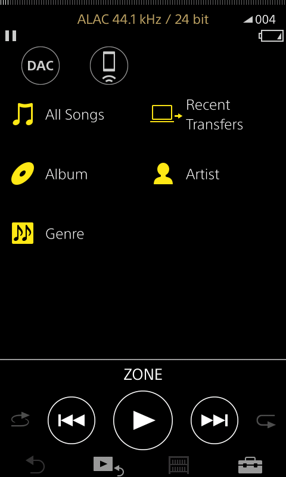

# mrwalkman-colours
Allows for re-colouring of the icons in MrWalkman's firmware.

Upon first installation, 4 new colours are available to replace the insipid ones included in the existing firmware.  A config file is created on the internal storage under COL\colours.cfg.  You can edit the 4 colours and re-run the installer to change them.  Instructions can be found in the config file after first use.

This is only compatible with MrWalkman firmware and only tested on an NW-A55.  While there are safeguards to prevent damaging anything it is recommended to backup your device before installing using @unknown321's tool: https://github.com/unknown321/wbrt

Installer build using @unknown321's nw-installer: https://github.com/unknown321/nw-installer

Thank you to @unknown321 for answering questions I had and for creating a bunch of amazing tools and useful documentation.
